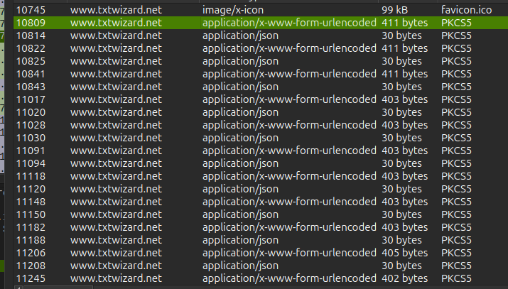

# online-encryption

We can look in wireshark at `File -> Export -> HTTP Objects` and we see a bunch of files. The one that is interesting (thanks to the ctfs name) is a file named crypto.
After exporting it I see it is a HTML page. 
The file came from a website named https://txtwizard.net, this website performes encryption in your browser and no data is transfered anywhere.
So I looked to see if there are any more files comming from txtwizard, and I found some:



After downloading the files I found this in some of them:
```
plainText=UlBGUHtxcTU0NX
plainText=NvczEyc3E2MDhx
plainText=bm44cDIwMXM1MH
plainText=M5NXA4NTIwb3Jw
plainText=OXM3NDRuMzU3M2
plainText=8xcXAwb3A1M3By
plainText=MDE5NzI2fQ
```

After putting each string in cyberchef and decoding them from base64 I got this:
`RPFP{qq545sos12sq608qnn8p201s50s95p8520orp9s744n3573o1qp0op53pr019726}`

So I applied a rot13 on it and got the flag.

flag: `ECSC{dd545fbf12fd608daa8c201f50f95c8520bec9f744a3573b1dc0bc53ce019726}`