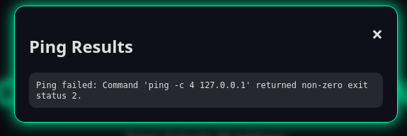

# ping-station-v2

After sending just `127.0.0.1` to check we get this beautifull output:

This tells us 2 things.
 1. The server runs: `ping -c 4 {INPUT}`
 2. ping retunrs an error even on localhost. 

So we have only solution for this. We will use `||` to pipe and ignore the output of the ping command and add our command.

After trying the input: **127.0.0.1||cat flag.txt** I got the error that space isn't allowed. So I added the character `${IFS}` instead of space and it worked. 

> Full command: **127.0.0.1||cat${IFS}flag.txt**

flag: `CTF{6a9ab89f423248a3e9485de0116a661c6bef38c5de2e4eef1aec00963042f47e}`