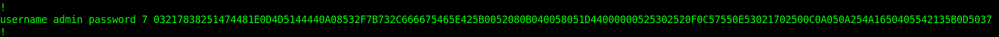

# unusual-communication

By the description of the ctf we can asume the admin made a png screenshot and we can look for a PNG header (search for `PNG` through the requests data).
We find the requests 33 and 34 to have that.
They are ICMP requests (Internet Control Message Protocol) made by the ping command.

After reading a little about the ping command we find out that we can send files with it. (https://glc.st/posts/file-transfer-with-ping/) Probably that is what is happening here.
We now have to extract all the data from the ping command (as hex) and put it together to probably get the png file.
We will only work with the data that is send as a request since the replay looks to me the same (I might be wrong).

After running this python script to extract the data from the ping command we get a big hex string we put in cyberchef, hit from hex and then download file.


We open the png and inside it we have this:


```
username admin password 7 03217838251474481E0D4D5144440A08532F7B732C666675465E425B0052080B040058051D44000000525302520F0C57550E53021702500C0A050A254A1650405542135B0D5037
```

flag: `ECSC{5d0d4436ad7e07d5375948ad13746fe2987aa7fd7126dfdd47acedf89905a0a4}`