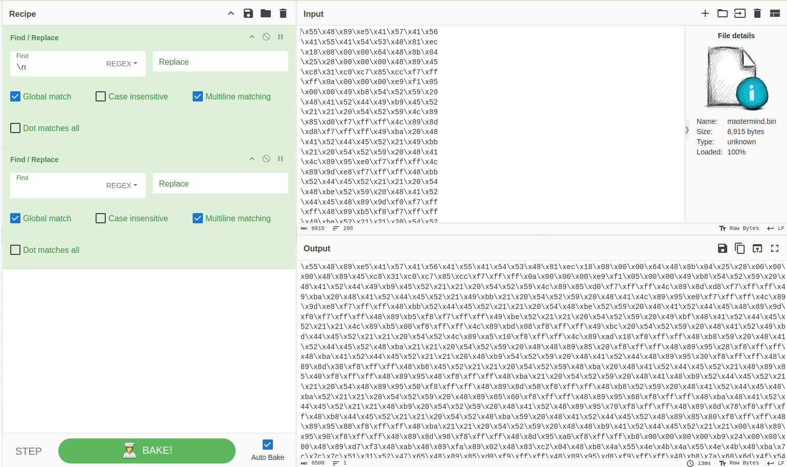

# mastermind

After tring to simply open the file in ida or run it I figured out it might be some sort of shellcode hidden in the file as hex or something.

So I put the file in cyberchef and played a little bit with it.
This was an acceptable output:



After that I made this `C` code to execute the assembly instructions.

(It's ugly I know.)

After running it in gdb and waiting a little while I decided to do a ctr+c and I was hit with a bunch of try harder messages.
After pinting every register I know I decided to do a `x/100gx $rsp` and at first I didn't see anything, but after looking at the random numbers in hex I took some and decoded them in cyberchef.
The first gave me Try Harder, but then I reached some numbers that gave me: `JUNK` and something that looked like a base64 string.
```c++
0x7fffffffcd1c:	0x0000000000000000	0xf7fb414000000000
0x7fffffffcd2c:	0x4b4e554a00007fff	0x517c7c7c4b4e554a
0x7fffffffcd3c:	0x4f6d687a65475231	0x59684e7a59784d54
0x7fffffffcd4c:	0x4e6a68544d6a6454	0x596946575a7a4557
0x7fffffffcd5c:	0x596852474f30676a	0x4d3263445a776b54
0x7fffffffcd6c:	0x4e7a51575a336b54	0x596868444e784144
0x7fffffffcd7c:	0x4f6c526d4d776354	0x4f3449444f6b5654
0x7fffffffcd8c:	0x5a6842544f784947	0x554a7c7c7c395657
0x7fffffffcd9c:	0x554a4b4e554a4b4e	0x0000000000004b4e
```

After to much trial and error I managed to make this python script to decode the data.
[[mastermind-decoder.py]]

flag: `CTF{8f931c3aa7c18c5a3eabb848daa90d76197ed340148aa702de95d8288b190aee}`