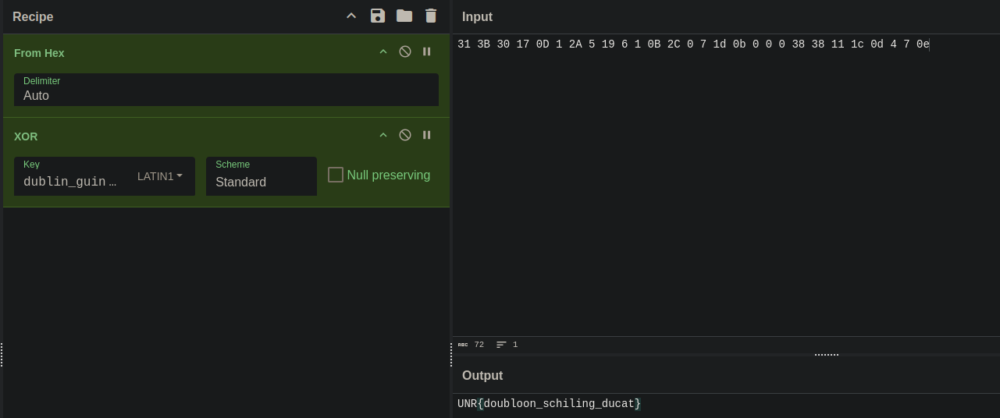

# leprechaun

After putting the binary in ida I found that it has a function named `sub_201010`
I couldn't decompile it into c because of some sp issue that no matter how hard I tried wasn't going to get fixed.
So I looked in the assembly. And from what I could understand it was that it was xoring some hex values with the string: `dublin_guiness`

So I copied the hex values: `31 3B 30 17 0D 1 2A 5 19 6 1 0B 2C 0 7 1d 0b 0 0 0 38 38 11 1c 0d 4 7 0e`
And out them into cyberchef and xored them with the string to get the flag.

flag: `UNR{doubloon_schiling_ducat}`