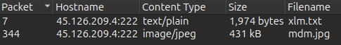

# XLMRat

#### Q1:
We can do `File -> Export Object -> HTTP` and we will see 2 files.
Since we know the file has to have the `.j__` extentsion we can take the one that has the `.jpg` extenstion and get this flag by taking the source and the filename:
flag: `http://45.126.209.4:222/mdm.jpg`


#### Q2:
We take the ip address and we go on an ip lookup webiste.
https://whatismyipaddress.com/ip/45.126.209.4
We can see the ip is owned by: `reliablesite.net`
flag: `reliablesite.net`

#### Q3:
I copied the first hexstring in the file and pasted into cyberedu.
After puting from hex and converting the output to sha256 I got the flag.
flag: `1eb7b02e18f67420f42b1d94e74f3b6289d92672a0fb1786c30c03d68e81d798`

#### Q4:
I put the sha in virustotal and got this as one of the tags: `AsyncRAT`
flag: `AsyncRAT`

#### Q5:
In virustotal in the details tab we can find the creation time: `2023-10-30 15:08:44 UTC`
From that we get the flag.
flag: `2023-10-30 15:08`

#### Q6:
Looking in wireshark at the request we see this:
```
$NK = $Fu.GetType('N#ew#PE#2.P#E'-replace  '#', '')
$MZ = $NK.GetMethod('Execute')
$NA = 'C:\W#######indow############s\Mi####cr'-replace  '#', ''
$AC = $NA + 'osof#####t.NET\Fra###mework\v4.0.303###19\R##egSvc#####s.exe'-replace  '#', ''
$VA = @($AC, $NKbb)
```

From it we can reconstruct this:
`C:\Windows\Microsoft.NET\Framework\v4.0.30319\RegSvcs`
flag: `C:\Windows\Microsoft.NET\Framework\v4.0.30319\RegSvcs.exe`

#### Q7:
Looking in the request we can see that this 3 files are droped: Conted.ps1,Conted.bat,Conted.vbs

flag: `Conted.ps1,Conted.bat,Conted.vbs`