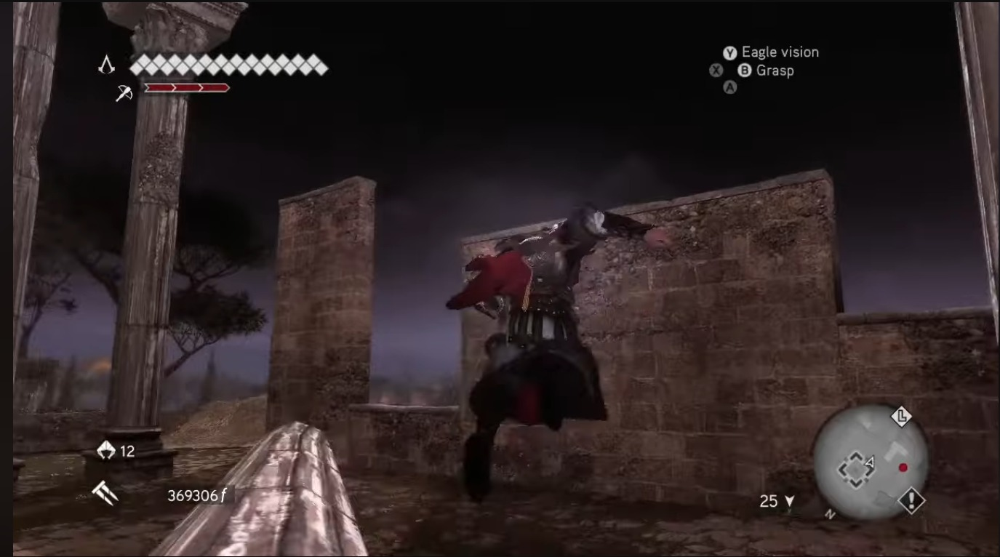
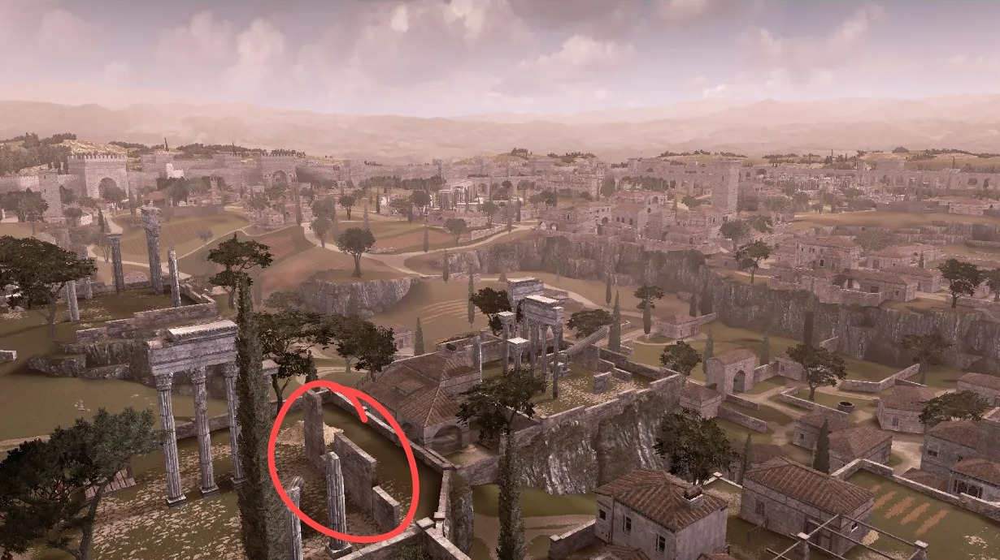
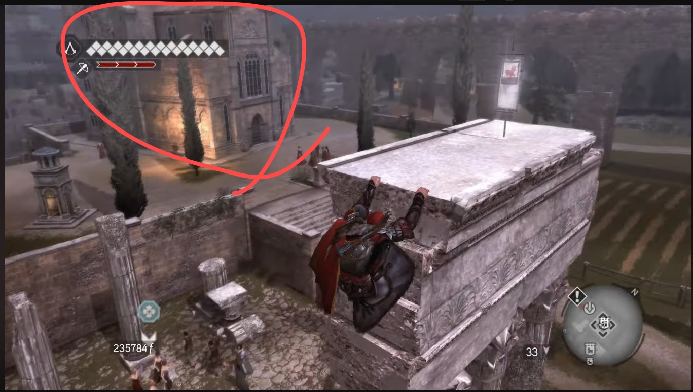

# Believer
## OSINT (osint)

Searching online using Google Lens reveals that the screenshot was taken in Assassin's Creed: Brotherhood, most likely in the Campagna or Antico districts, as those looked the most like the screenshot.  
We first looked on the [Wiki](https://assassinscreed.fandom.com/wiki/Category:Districts_of_Rome) at the landmarks listed for each district, but we couldn't find any that fit.   

Matei looked on an [online map](https://wand.com/maps/assassins-creed-brotherhood/rome) but couldn't find anything either.  
By this point we were pretty sure the screenshot was from the Campagna District.  
I ended up looking at YouTube videos of Assassin's Creed: Brotherhood gameplay in the Campagna District.   

I started with this video: [Assassin's Creed: Brotherhood - Capture the Flag (Campagna District)](https://youtu.be/ZrY7OqwvdpY) because the title was funny given the circumstances.  

While I was watching it, I noticed a location that also appeared in the screenshot:
  
  

Using this, I was fairly certain that I figured out the building the screenshot was taken from, which was barely visible in a previous clip:
![[Pasted image 20260720195714.png|628]]  

Next I watched this video to try to get a better angle of the building: ["Assassin's Creed: Brotherhood", All 101 Borgia flags locations](https://youtu.be/-btaYwoPm_s), which I did:
  

Using Google, I ended up finding the [Chiesa della Trinità dei Monti](https://assassinscreed.fandom.com/wiki/Chiesa_della_Trinità_dei_Monti), thus solving the CTF.  

(Solved by Tudor after losing his sanity)