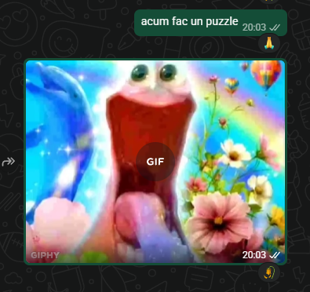

# Sanity P0zzl3
## Miscellaneous (misc)

I used Krita to solve the puzzle manually.  
I looked at the pieces in the folder and uploaded the ones I thought I needed.  
Each time I uploaded one I moved it to a different folder so I knew which ones were unused.  
I started with the edges and worked my way inwards. 

For the edges, I figured out which pieces went together based on their shapes (the connection points had slightly different shapes that would fit in certain spaces), for the inside ones I mostly based it on pixels that were cut in half by piece borders (I looked for pieces that would continue a pattern) while also keeping in mind the shape of the piece I needed.  
I scanned the final QR code with my phone to get the flag.

(Solved by Tudor while Bogdan and Matei were out drinking)
