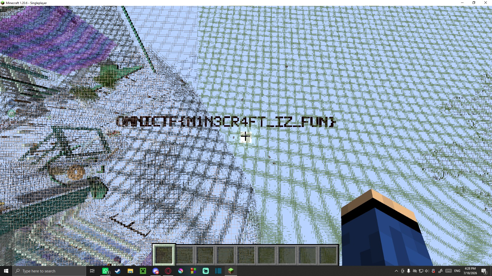

# Shibiu
## Game (game)

Matei was initially in charge of solving this one.  
He searched around the map for clues and found two (literal) flags on the edges of the city and wrote down the coordinates.  
He looked around them for the flag we needed, including searching in the weird tunnels underneath them, but found nothing.  
Meanwhile I found the creator of the original map on instagram by looking up the username written on the signs at spawn, found a post about the map, which led me to a website from which I could download it.   
I used MCA Selector to try to compare the maps (original Shibuya map and the Shibiu map), which is when I noticed the original map also had the two (literal) flags, so then our theories kind of went out the window (we thought the flags were added and had something to do with the flag we needed to get).  
The next day, Bogdan suggested looking around the Shibiu map with x-ray to more easily see any possible secrets, so I tried that.   
I teleported to the coordinates of the two (literal) flags and fount the flag we needed close to the (literal) flag at `X: 265, Y: -60, Z: 35`.  

(Solved by Tudor, with help from Matei and Bogdan (team effort)) 